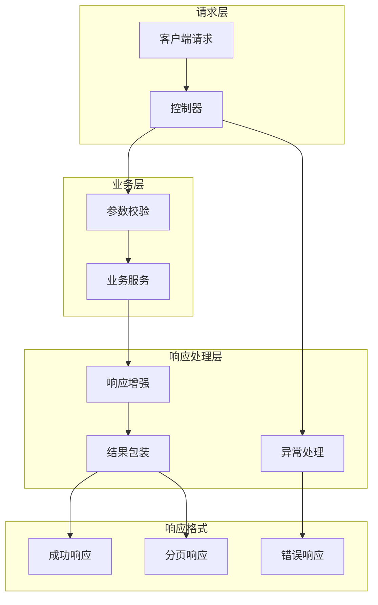

# 🎯 test-GracefulResponse - 优雅响应框架测试


## 📖 项目简介

test-GracefulResponse是Graceful Response框架的测试项目,演示如何使用Graceful Response实现统一响应格式、异常处理、参数校验等功能。

## 🏗️ 系统架构



## 🚀 快速开始

```bash
# 克隆项目
git clone https://github.com/yourusername/test-GracefulResponse.git

# 运行项目
mvn spring-boot:run

# 访问测试
curl http://localhost:8080/api/test
```

## 💡 核心示例

### 统一响应格式

```java
@Data
@AllArgsConstructor
@NoArgsConstructor
public class Result<T> {
    private Integer code;
    private String message;
    private T data;
    private Long timestamp;
    
    public static <T> Result<T> success(T data) {
        return new Result<>(200, "success", data, System.currentTimeMillis());
    }
    
    public static <T> Result<T> error(Integer code, String message) {
        return new Result<>(code, message, null, System.currentTimeMillis());
    }
}
```

### 全局异常处理

```java
@RestControllerAdvice
public class GlobalExceptionHandler {
    
    @ExceptionHandler(BusinessException.class)
    public Result<Void> handleBusinessException(BusinessException e) {
        return Result.error(e.getCode(), e.getMessage());
    }
    
    @ExceptionHandler(Exception.class)
    public Result<Void> handleException(Exception e) {
        return Result.error(500, "系统错误");
    }
}
```

## 📝 更新日志

### v1.0.0 (2024-01-01)
- ✨ 初始版本发布
- ✨ 完成统一响应格式
- ✨ 完成全局异常处理

---

⭐ 如果这个项目对你有帮助,欢迎Star支持!
